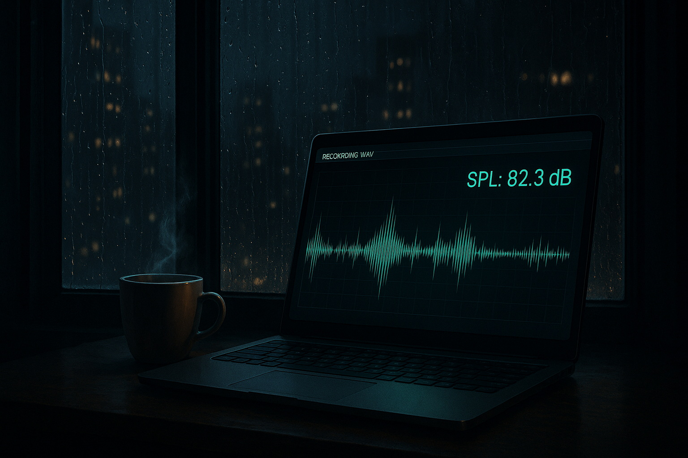

[](LICENSE)

# 🔊 AcousticLog — Real-time Noise Monitor & Automated WAV Merger
[](https://github.com/AndreyBorisovichKoval/AcousticLog/releases/latest)

🎧 **AcousticLog** — это приложение для **непрерывного мониторинга уровня шума в реальном времени**,  
с записью результатов в CSV-файлы, сохранением аудиофрагментов при превышении заданных порогов  
и **автоматическим объединением коротких WAV-файлов в почасовые** для удобного прослушивания.

Программа анализирует входящий поток звука (через **WinMM API**), вычисляет уровень звукового давления (SPL),  
ведёт журналы событий и сохраняет WAV-файлы при детектировании превышений или импульсных звуков.

---

## ⚖️ Юридический статус данных (Важное примечание)

Программа **AcousticLog** является инструментом для **непрерывного мониторинга** и **предварительной фиксации** шумовых событий.

**ВНИМАНИЕ:**

1.  **Не является поверенным прибором.** Измерения, полученные с помощью AcousticLog и встроенного микрофона ПК, **не имеют юридической силы** в суде, Роспотребнадзоре или других официальных инстанциях.
2.  **Цель программы:** Данные (CSV-логи и WAV-файлы) могут служить **дополнительным обоснованием** для вызова полиции/экспертов, но **не заменяют** официальную экспертизу.
```text
ВАЖНОЕ УТОЧНЕНИЕ: Факты vs. Уровень

AcousticLog юридически не доказывает превышение нормы (точное значение уровня в дБ), поскольку не является сертифицированным шумомером.

Однако, программа предоставляет неопровержимые фактические доказательства самого СОБЫТИЯ:

ФАКТ №1: Время и дата возникновения шумового события.
ФАКТ №2: Длительность события.
ФАКТ №3: Аудиозапись самого события, подтверждающая его характер (например, стук, ремонт, громкая музыка).

Эти факты служат обоснованием для вызова аккредитованных лабораторий, которые уже установят юридически значимый уровень шума.
```

Для получения юридически значимых доказательств превышения уровня шума необходимо обращаться в **аккредитованные лаборатории** с использованием **сертифицированных шумомеров**.

---

## 💻 Требования и зависимости

- **Операционная система:** Windows (используется `winmm.dll`).
- **Среда:** Go 1.18+ (для поддержки модулей и пакета `golang.org/x/sys/windows`).
- **Аудио:** Активный микрофон или устройство записи в системе.

---

## 💾 Аппаратные требования

> Версия **v1.01.00** использует 8+ горутин для параллельной обработки звука, записи и автоматического объединения WAV,  
> поэтому стабильность зависит от производительности оборудования.

| Компонент | Минимум | Рекомендация | Примечание |
|-----------|----------|--------------|-------------|
| **Процессор (CPU)** | Dual-Core / Core i3 / Ryzen 3 | 4 ядра / Core i5 / Ryzen 5+ | Требуется стабильное многопоточное исполнение для обработки I/O и звука |
| **Накопитель (Storage)** | SSD | SSD | ⚠️ HDD не гарантирует устойчивость при одновременной записи |
| **Свободное место** | 5 ГБ | 10 ГБ+ | Программа предупреждает и останавливается при низком уровне места |
| **ОС / Среда** | Windows, Go 1.18+ | Windows 10/11 (x64), Go 1.18+ | Используется низкоуровневый `winmm.dll` |

---

## 📁 Структура проекта

Код организован по принципу Go-проекта с разделением на пакеты `cmd` и `internal` для повышения модульности и читаемости.

```text
C:\...\_Projects_Go\AcousticLog
│
├── cmd
│   └── acousticlog
│       └── main.go                  # Точка входа: парсинг флагов, печать шапки, запуск app.Run()
│
├── internal
│   ├── app\                         # Основная логика приложения
│   │   ├── config.go                # Парсер флагов командной строки, структура Config
│   │   ├── lifecycle.go             # Главный цикл: запуск, аудио-захват, каналы, координация горутин
│   │   ├── rotation.go              # Ротация по дате и часу, обновление CSV и WAV, статистика
│   │   ├── hour_watcher.go          # Детектор смены часа, триггер фонового мерджа WAV
│   │   ├── merge_scheduler.go       # Планировщик и выполнение объединения WAV-файлов
│   │   ├── liveui.go                # Live-интерфейс: цветной вывод, обновление экрана, статистика
│   │   ├── helpers.go               # Вспомогательные функции для времени, порогов и форматирования
│   │   ├── flags_helpers.go         # Поддержка токенов /auto, /run, /quiet
│   │   └── types.go                 # Основные структуры: App, AppStats, buffer, wavTask и др.
│
│   ├── audio
│   │   └── winmm\                   # Работа с WinMM API (захват звука в реальном времени)
│   │       ├── types.go             # Структуры WAVEHDR, WAVEFORMATEX, константы WinMM
│   │       └── wavein_windows.go    # Инициализация, открытие устройства, поток данных
│
│   ├── build\                       # Метаданные сборки и версия приложения
│   │   └── meta.go                  # BuildVersion, BuildDate, Author, функция PrintHeader()
│
│   ├── io\                          # Работа с файловой системой и логами
│   │   ├── dirs.go                  # Создание структуры директорий (день, час, CSV, WAV)
│   │   ├── csvlog.go                # Асинхронная запись CSV-логов (все данные / события)
│   │   ├── wavsave.go               # Сохранение WAV-файлов, обработка EXCEEDED и IMPULSE
│   │   ├── merge.go                 # Механизм объединения коротких WAV-файлов в почасовые (v1.01.00)
│   │   └── eventkind.go             # Константы "EXCEEDED" / "IMPULSE" для маршрутизации аудио
│
│   ├── mathx\                       # Аудио-математика и вычисление уровней
│   │   └── audiolevel.go            # RMS, dBFS/dBSPL, преобразование PCM-буферов
│
│   └── sys\                         # Системные вызовы и работа с консолью
│       ├── ansi_windows.go          # EnableANSI(), управление цветами, очистка консоли
│       └── disk_windows.go          # Получение информации о свободном месте на диске
│
├── go.mod                           # Определение модуля: module github.com/AndreyBorisovichKoval/AcousticLog
├── go.sum                           # Контрольные суммы зависимостей
│
└── README.md                        # Документация проекта, структура, примеры, история версий
```

---

## 🧠 Техническое устройство (архитектура потоков и каналов)

🔄 Потоки и каналы
```text
[Audio Input]
      │
      ▼
  process()
  ├──> chAllCSV ──> CSV (all)
  ├──> chMainCSV ─> CSV (events)
  └──> chWAV ─────> WAV-файлы (WAV saver / pool)

```

| Канал | Буфер | Назначение | Обрабатывается |
|-------|--------|-------------|----------------|
| `chMainCSV` | 256 | События (EXCEEDED, IMPULSE) | CSV Writer (events) |
| `chAllCSV` | 512 | Все измерения | CSV Writer (all) |
| `chWAV` | 256 | Очередь задач WAV | WAV Saver pool (1–3) |

💡 Программа использует **3 буферизованных канала** и **3–5 горути́н** для фоновой записи,  
что обеспечивает **высокую устойчивость к задержкам I/O** без потери данных.

---

## 🧠 Архитектура и конкурентность (Concurrency)

**AcousticLog** построен по принципу **конвейерной архитектуры** (Pipeline Architecture),  
используя **goroutines** и **channels** для изоляции (*отдельные горутины изолируют аудиозахват от дисковых операций*).

| Компонент | Кол-во | Назначение | Принцип работы |
|------------|--------|------------|----------------|
| Захват аудио | 1 | Чтение буферов WinMM | Отправка данных в канал |
| Анализ / маршрутизация | 1 | Подсчёт SPL, детекция | Отправка данных в каналы CSV/WAV |
| CSV-запись (all / events) | 2 | Асинхронная запись | `sound_all.csv` и `sound_log.csv` |
| WAV-сейвер (pool) | 1-3 | Сохранение фрагментов | `EXCEEDED`, `IMPULSE` |
| Часовой вотчер | 1 | Отслеживает смену часа | Триггер для мерджа WAV |
| Планировщик мерджа | 1 | Автоматическое объединение WAV | Фоновая задача |
| Завершение (Graceful Shutdown) | 1 | Корректное завершение | Запускает финальный мердж |

> ⚙️ Все задачи изолированы каналами (`chAllCSV`, `chMainCSV`, `chWAV`),  
> чтобы **задержки диска не влияли на точность аудиозахвата**.

🧠 Итого: обычно активно 8–10 горутин, включая пул WAV-сейвера и фоновые задачи.  
⚙️ Каналы chAllCSV, chMainCSV и chWAV обеспечивают изоляцию между аудиозахватом и файловыми операциями,
чтобы никакие задержки диска не влияли на точность измерений.

---

## ⚙️ Механизм слияния WAV (v1.01.00)

Почасовое объединение WAV-файлов выполняется автоматически:

- Триггер: смена часа (`10:59:59 → 11:00:00`) или `Ctrl+C`;
- Источник: короткие WAV-файлы из `EXCEEDED`;
- Имя: `merged_exceeded_YYYY-MM-DD_HH.wav`;
- Папка: `_Merged_Exceeded` (создаётся автоматически).

Механизм реализован **на чистом Go** (*потому как могЁт*) и выполняется **в фоне**, не прерывая основной поток записи.

---

## 🛠️ Сборка и запуск

### 🔧 Сборка (с встраиванием времени)

Для встраивания актуальной даты и времени компиляции в бинарный файл используется флаг `-ldflags`:

```bash
go build -ldflags "-X acousticlog/internal/build.BuildTime=$(date '+%%Y-%%m-%%d %%H:%%M:%%S')" ./cmd/acousticlog/
```

> 💡 Примечание: используйте `%%` в `date`, если запускаете в Windows `.bat` файле.

---

### ▶️ Запуск

Запуск осуществляется исполняемым файлом `acousticlog.exe` с режимами `/run` или `/auto`.

**Примеры запуска:**

```bash
# Рабочий режим с авто-остановкой в 02:00
acousticlog.exe /run --tz "Asia/Dushanbe"

# Непрерывный тихий режим с логированием всех данных
acousticlog.exe /auto /quiet --log-all

# Непрерывный тихий режим с коррекцией 114
acousticlog.exe /auto --spl-offset 114
```

---

## ⚙️ Флаги командной строки

Все флаги необязательные и имеют значения по умолчанию.  
Режимы (`/run`, `/auto`, `/quiet`) передаются **без дефисов**.

| Флаг | Тип | По умолчанию | Описание |
|------|-----|---------------|----------|
| `-spl-offset` | float64 | **114** | Калибровка dBFS → dB SPL (смещение чувствительности микрофона) |
| `-day-limit` | float64 | 55 | Порог шума днём (дБ) |
| `-night-limit` | float64 | 45 | Порог шума ночью (дБ) |
| `-day-start` | string (HH:MM) | "07:00" | Время начала дневного периода |
| `-day-end` | string (HH:MM) | "23:00" | Время окончания дневного периода |
| `-stop-at` | string (HH:MM) | "02:00" | Время автоостановки (используется в режиме `/run`) |
| `-samplerate` | int | 16000 | Частота дискретизации (Гц) |
| `-duration` | int (мс) | 200 | Длительность аудиобуфера в миллисекундах |
| `-tz` | string | "Asia/Dushanbe" | Часовой пояс работы программы |
| `-log-all` | bool | false | Логировать все измерения, а не только события превышений |
| `-impulse-delta` | float64 | 15 | Минимальная разница уровней (дБ) для детектирования импульса |
| `-disk-warn-mb` | uint64 | 100 | Порог предупреждения о низком уровне свободного места (МБ) |
| `-disk-stop-mb` | uint64 | 50 | Минимум свободного места для остановки записи (МБ) |
| `-live-lines` | int | 70 | Количество строк в Live UI до очистки экрана |
| `-live-no-clear` | bool | false | Не очищать экран при достижении лимита строк |
| `-append-live` | bool | false | Режим дописывания Live UI без перерисовки (альтернатива очистке) |
| `-csv-delim` | string | ";" | Символ-разделитель в CSV-логах (берётся первая руна строки) |
| `-live-wav-depth` | int | 3 | Глубина отображаемого пути к WAV-файлам в Live UI |
| `-console-page` | bool | false | Постраничный вывод данных в консоль |
| `-console-page-size` | int | 70 | Размер страницы для режима `-console-page` |
| `-no-hourly-merge` | bool | false | Отключить автоматическое почасовое объединение WAV-файлов |
| `-hourly-merge-out` | string | "_Merged_Exceeded" | Папка для объединённых WAV-файлов |
| `/run` | token | — | Запуск с автоостановкой в `-stop-at` |
| `/quiet` | token | — | Тихий режим — без интерактивного интерфейса |
| `/auto` | token | — | Непрерывный режим без остановки |

💡 **Примечания:**
- Все числовые значения в МБ и дБ задаются как **целые** или **вещественные** без единиц измерения.  
- `-csv-delim` принимает строку, но используется только первый символ.  
- Режимы `/auto`, `/run` и `/quiet` можно комбинировать с любыми другими параметрами.

💡 Значение `-spl-offset` по умолчанию (**114**) оказалось оптимальным именно для встроенного микрофона моего ноутбука.  
Используйте его лишь как отправную точку — подберите собственное значение экспериментально.

---

## ⏹️ Завершение работы программы

Остановить AcousticLog можно в любой момент:

- **Через клавиатуру:** нажмите `Ctrl + C` в окне консоли.  
  Программа корректно завершит все фоновые процессы,  
  сохранит текущие CSV и закроет WAV-потоки.

- **При режиме `/run`:** AcousticLog автоматически завершится  
  в указанное время (`-stop-at`, по умолчанию 02:00).

- **При режиме `/auto`:** программа работает бесконечно (*бесконечный цикл*),  
  завершение только вручную (`Ctrl + C` или закрытие консоли).

Во время выхода AcousticLog выполняет:
1. Остановку WinMM-захвата (`waveInStop` / `waveInClose`);
2. Завершение всех горутин записи CSV и WAV;
3. Сброс буферов и вывод финальной статистики.

---

## 🎚️ Калибровка SPL

Разные микрофоны могут показывать уровень шума с отклонением.  
Параметр `-spl-offset` позволяет скорректировать измерения под реальный уровень.

### Быстрая настройка

1. Запусти:
   ```bash
   acousticlog.exe /run -spl-offset=0
   ```
2. Воспроизведи **эталонный звук** (например, 1 кГц @ 94 дБ).  
3. Сравни с эталонным SPL-метром.  
4. Вычисли офсет:
   ```
   spl_offset = SPL_ref − SPL_meas
   ```
5. Перезапусти с поправкой:
   ```bash
   acousticlog.exe /run -spl-offset=7
   ```

После этого все значения в CSV будут скорректированы.  
> 💡 Пример: если AcousticLog показал 87 дБ при 94 дБ эталоне, офсет = +7 дБ.

---

## 💾 Структура выходных данных

Результаты сохраняются в каталоге `C:\DataSound_Temp` (или `D:\DataSound_Temp`, если существует диск D:).  
Каждый день автоматически создаётся новая структура.

```
C:\DataSound_Temp\YYYY-MM-DD\
│
├── CSV\
│   ├── sound_log_YYYYMMDD_HHMMSS.csv    # события (превышения, импульсы)
│   └── sound_all_YYYYMMDD_HHMMSS.csv    # полный лог всех измерений
│
└── WAV\
    ├── _Merged_Exceeded\ # объединённые WAV-файлы (v1.01.00)
    │   ├── merged_exceeded_YYYY-MM-DD_00.wav
    │   └── ...
    ├── HH\                              # час записи (00–23)
    │   ├── EXCEEDED\                    # длительные превышения порога
    │   │   ├── noise_YYYYMMDD_HHMMSS.wav
    │   │   └── ...
    │   └── IMPULSE\                     # импульсные пики
    │       ├── noise_YYYYMMDD_HHMMSS.wav
    │       └── ...
    ├── HH+1\
    │   ├── EXCEEDED\
    │   └── IMPULSE\
    └── ...
```

---


---

## 🧾 Версия и авторство

**Версия:** `v1.01.01 (PATCH Update)`  
📅 **Дата сборки:** 2025-10-25

🧩 **Состояние:** первая стабильная публичная версия AcousticLog  
🔧 **Совместимость:** Windows 10/11 (x64), Go 1.18+

📄 **Автор:** [Andrey Koval (57)](mailto:andrey.koval.dev@gmail.com)  
📧 **Email:** [andrey.koval.dev@gmail.com](mailto:andrey.koval.dev@gmail.com)  
📍 **Местоположение:** Dushanbe, Tajikistan  

_“Measure sound, log events, and keep calm — AcousticLog is listening.”_ 🎧 😊

---

## 🧾 История версий

### v1.01.01 — 2025-10-25 (*Patch Update*)
- **Документация:** Устранено противоречие в README, касающееся "юридической силы" данных.
* Чётко разделены **ФАКТЫ** (время, длительность, запись) и **Юридический уровень** (дБ).
- **Патчи:** Мелкие исправления и улучшения внутренней стабильности.

### v1.01.00 — 2025-10-25 (*Minor Update*)
- Добавлен механизм автоматического объединения WAV по часам;
- Расширен параллелизм (8+ горутин), улучшена стабильность I/O;
- Улучшен Live UI, корректное завершение и контроль места на диске.

### v1.00.00 — 2025-10-22 (*Stable*)
- Первая стабильная версия: WinMM-захват, CSV-логи, сохранение WAV при EXCEEDED/IMPULSE, ротация, Live UI.

---

## P.S.

### Личная мотивация

*AcousticLog* был разработан, исходя из личной необходимости, и в очень сжатые сроки. Проект стал прямым ответом на систематические нарушения тишины со стороны соседей. Главная цель была не создать коммерческий продукт, а получить **непрерывный, автоматический лог** самого факта нарушения (*времени, длительности и интенсивности*), поскольку традиционные методы фиксации были неэффективны.

- Проект сделан без излишеств, но с акцентом на надёжность и функциональность.

#### Почему нет GUI?..
*Для тех, кто спрашивает*

**Go** изначально заточен под бэкенд, сети и системное программирование (💯), а не под создание графических интерфейсов.
Я - бэкенд-разработчик, и моя цель - делать программы, которые работают стабильно и незаметно, как хороший системный сервис.
Консоль + логи + WAV-записи - этого достаточно для сбора доказательств. Если кому-то нужен GUI, его всегда можно добавить (например, на Electron или PyQt), но это уже будет другой проект. 😉

Для кого этот проект?..  
Для тех, кому важны **объективные ФАКТЫ** (*время, длительность, запись*) для документального подтверждения нарушений и обоснования вызова официальных служб.

Если проект поможет кому-то ещё - **Здорово**!!! 🙌

---
